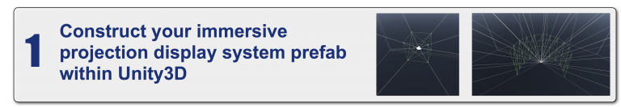
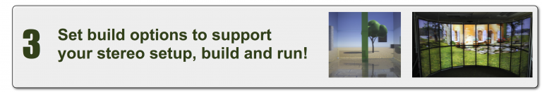

## Description

The UniCAVE project aims to build a plugin for [Unity3D](https://unity3d.com) that provides support for CAVE environments utilizing features built into the engine. This approach enables a user to configure their system entirely in the Unity3D editor providing a simplified method for supporting adapting existing Unity projects for distributed visualization platforms.

The concept for the plugin is to have a three step approach for integration:

This project is currently **_under development and is a work in progress_**.  Please feel free to _contribute to this project_ or read over the [documentation](https://github.com/widVE/UniCAVE/wiki) to learn if the plugin is right for you.

## Current Features

- Native Unity3D time synchronization via Unity’s timeScale feature to distributed synchronization

- NetworkView RPC calls for synchronizing random seeds and dynamic objects

- VRPN Unity plugin to handle tracking systems

* In-editor preview of asymmetric view frustums

**Works with:**

## Features in Development

- Improved clustered input device support

- Support for additional input devices (Kinect, Leap, Oculus Touch, etc.)

- Improved “plug & play” features for clusters (reducing amount of code editing needed to adapt a scene)

## Contribute to the Project

The UniCAVE project was created by students and researchers at UW-Madison who are passionate about immersive display environments. As the project does not receive any financial support from the campus, federal agency or external corporation all project development and support occurs on an ad hoc basis. If you have a request for features and/or support for the UniCAVE project we ask that you consider [donating to the project](https://secure.supportuw.org/give/?id=ac987d37-46b8-46f5-b2ae-71bba33ead5f). All donations will go towards ensuring that the UniCAVE project remains a free, open-source tool for all to use.